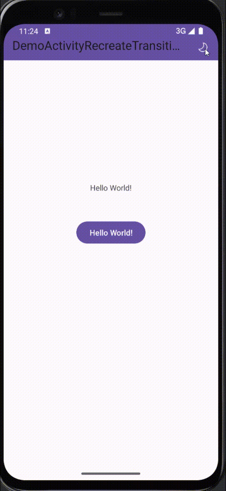

# Android Activity recreate重建（主题切换）过渡动画 Demo
当应用程序支持多种语言或主题时，切换语言或主题通常需要重新启动 *Activity* 以重新加载配置。虽然 *recreate* 是一种常用的重建 Activity 方法，但它不支持像在 Activity 之间切换时那样使用过渡动画。特别是在切换 *浅色/深色* 主题时，由于缺乏过渡动画而显得很生硬。为了提升改善这一点，只能自己实现过渡动画以提供更流畅的用户体验。

**参考文章：[Change Theme Dynamically with Circular Reveal Animation on Android](https://proandroiddev.com/change-theme-dynamically-with-circular-reveal-animation-on-android-8cd574f5f0d8) 实现**

大致实现步骤：
大致分为以下几步：

1. 将Activity设置为全屏
2. 在Activity原有的布局顶部添加一个隐藏的ImageView
3. **修改主题后保存状态并重建activity**
4. **activity重启后通过保存的状态执行动画**

博客：
[稀土掘金](https://juejin.cn/post/7335959102487003186)
[CSDN](https://blog.csdn.net/qq_45925230/article/details/136126818)

[Demo Apk](https://github.com/Thousand-Dust/DemoActivityRecreateTransition/releases)

实现效果：

